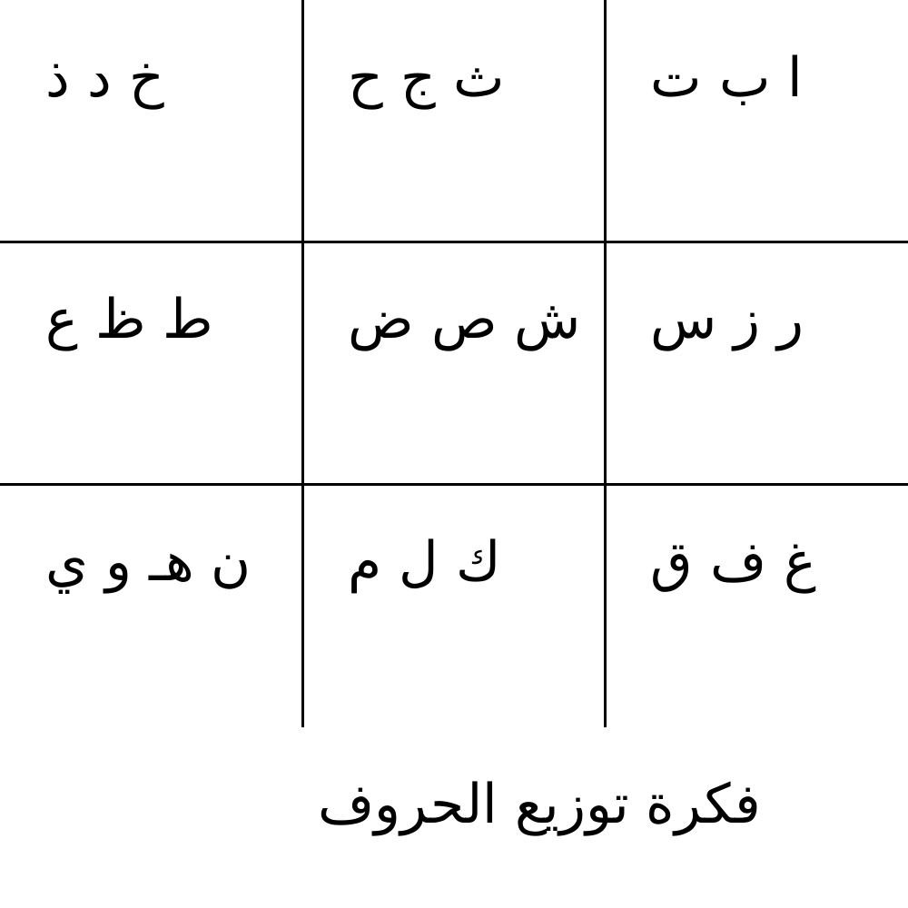

# Alfa Polygons Arabic Font

## فكرة الخط
بدأت الفكرة من رسم يدوي بسيط للحروف العربية باستخدام أشكال هندسية (مضلعات)، بحيث تكون النقاط جزء من التصميم وتعبر عن معنى الحرف وليس مجرد شكل إضافي.

تم اختيار أن يكون الخط مفصول (غير متصل) لأنه يعتمد على أشكال مستقلة لكل حرف.

---

## مراحل التنفيذ

### 1. رسم الفكرة الأولية
تم رسم الحروف يدوياً على الورق لتحديد شكل كل حرف باستخدام مضلعات ونقاط.

### 2. تحويل الرسم إلى SVG
تم إعادة رسم الحروف باستخدام برنامج Figma وتحويل كل حرف إلى شكل SVG منفصل.

يمكن مشاهدة ملفات التصميم هنا:
https://www.figma.com/community/file/1607550679347029215

### 3. تحويل SVG إلى خط
تم استخدام أدوات صناعة الخطوط لتحويل ملفات SVG إلى Font رقمي يدعم الويب.

### 4. تصدير الخط
تم تصدير الخط بصيغ:
- TTF
- WOFF
- WOFF2

ليكون جاهز للاستخدام في المواقع.

---

## تجربة الخط

يمكن مشاهدة الخط يعمل مباشرة على الموقع:

https://abo389.github.io/AlfaPolygonsArabicFont/

---

## ملاحظة
الخط مصمم بأسلوب هندسي Decorative لذلك الحروف تظهر مفصولة وليست متصلة.